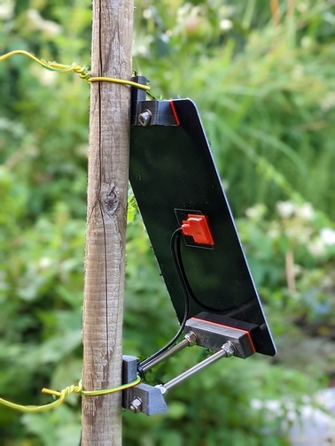
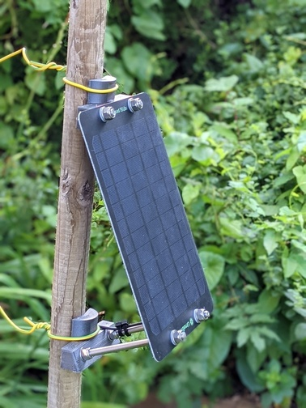
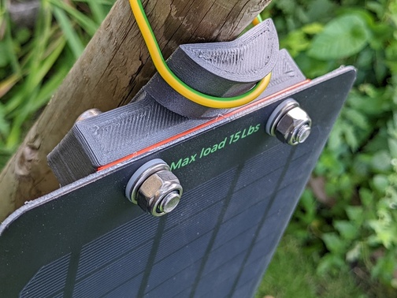
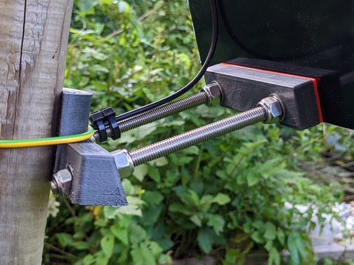

# Useful 3d printable parts

This directory contains stl files and their FreeCAD/OpenSCAD sources,
mainly created for the [ECS Case based groundstation](/_02pcb/ECSCase%20Board), but also useful for others.

## Solar panel
Either follow the description in the ECS Case BOM, or use these [solar panels](https://www.aliexpress.com/item/32890517531.html).

### Glue cover for electrical connections

#### BOM
* 1x printed [solar_panel_glue.stl](solar_panel/electrical_connection/solar_panel_glue.stl) (TPU/Flex Medium preferred)
* 1x printed [solar_panel_glue_top.stl](solar_panel/electrical_connection/solar_panel_glue_top.stl) (TPU/Flex Medium preferred)

#### Images/Instructions

1. Print parts, preferable in TPU or similar flexible material as it will fit tight around the cable without having to drill the whole for slightly larger cables. Also TPU allows to remove extra material easily in case the outer part is higher than necessary.
2. Solder cable to connectors.
3. Clean area properly using alcohol, especially from soldering residues and fingerprints.
4. Pull cable trough the printed outer part, position the part properly and use some tape to keep it in place temporarily.
5. Fill with 2-component epoxy glue until the cable and connectors are submerged (wear apprpriate gloves, mask, glasses!).
6. Drop top part on the glue, try to avoid having air bubbles under it.
7. Let it dry, if needed cut the sides of the outer part to keep them flat with the top part in case you did not fill it completely with glue. For TPU a sharp knive should be all you need. For harder material, carefully sanding it down might be an option.

### Mast/pole mount

Parts should be printed at least in ABS, preferable something stronger. My recommendation: [extrudr GreenTec Pro carbon](https://www.extrudr.com/en/products/catalogue/greentec-pro-carbon_2410/). The optional buffer/flexible part should be printed in TPU/Flex Medium/Shore A60 material.

#### BOM
* 2x printed [mast_mount.stl](solar_panel/mount/mast_mount.stl) (ABS/Carbon, rotate 90 degrees - flat side down, can be printed without supports.
* 1x printed [mast_mount_helper.stl](solar_panel/mount/mast_mount_helper.stl) (ABS/Carbon)
* optional: 2x printed [mast_mount_tpu_buffer.stl](solar_panel/mount/mast_mount_tpu_buffer.stl) (TPU/Flex Medium)
* 2x M8 x 35mm cylinder screw DIN912 stainless steel A2
* 2x M8 x 165mm threaded rod stainless steel A2
* 12x 8,4mm washer (for M8) DIN125 Form B stainless steel A2
* 12x M8 self-locking nut DIN985 stainless steel A2
* 4x M8 polyamide washer DIN125 (put betwen solar panel and metal washer to protect the panel)
* 2x hose pipe clips that will fit around your mast/pipe and the mount
* cable ties for the cable, you also might want to wrap some electical tape around the threaded rod to protect the cable if necessary.

#### Images/Instructions
Just build according to the images linked in this readme - I hope there is no extra explanation needed. Use hose pipe clips for proper mounting, cables were used to take photos only.

## Other parts
### 20.5mm flexible washer
[flex_washer_20.5mm.stl](other_parts/flex_washer_20.5mm.stl)

Printed in TPU or similar flexible Material, this serves as water-tightening washer
on the outside of the case when using the [waterproof RJ11 connector](https://www.aliexpress.com/item/1005004064498188.html).
